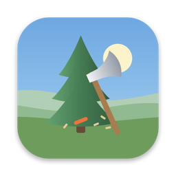
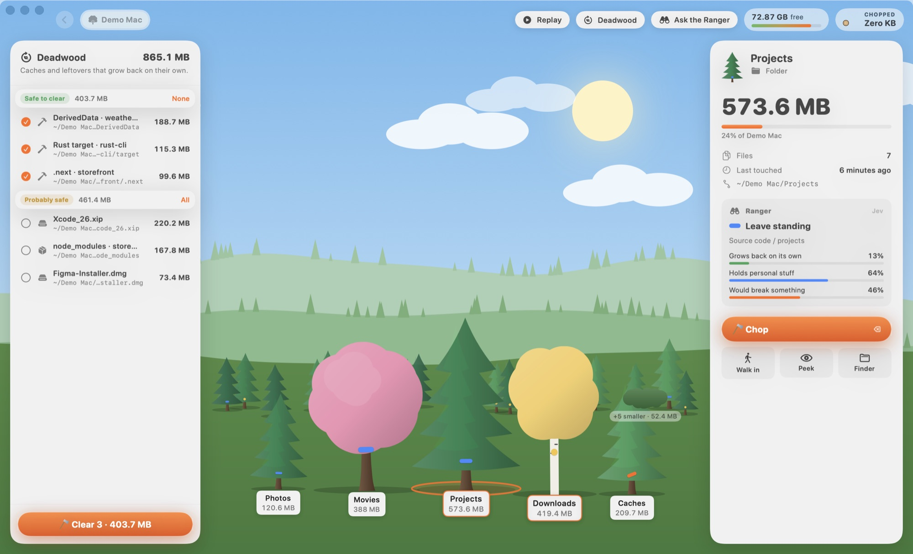

<p align="center"></p>

<h1 align="center">Timber</h1>
<p align="center"><b>Your disk is a forest. Chop what you don't need.</b></p>
<p align="center">
  <a href="https://github.com/acstener/timber/releases/latest/download/Timber.dmg"><b>Download for Mac</b></a> ·
  <a href="https://timber-mac.pages.dev">Website</a> ·
  <a href="PRIVACY.md">Privacy</a>
</p>

<p align="center"></p>

Timber is a native macOS app that turns your storage into a living forest. Every folder is a tree, sized by the space it takes. Find the deadwood, swing the axe, and get your gigabytes back — with a satisfying **TIMBER!**

- **Forest view.** Tree height tracks the square root of size, so canopy area tracks bytes. Folders grow as pines, media as blossoms, installers and archives as birches, apps as maples, caches as dead trees. Double-click to walk into a folder.
- **3D survey.** Scanning is a low-poly island under a lidar sweep, sprouting a tree for every folder measured (SceneKit). Millions of files in seconds, thanks to a parallel `fts(3)` walker.
- **Deadwood finder.** Xcode DerivedData, SwiftPM `.build`, `.next`, stale `node_modules`, pnpm/npm/yarn/bun/cargo/go/pip/uv caches, app caches, simulators, installers, old downloads — each rated *safe*, *probably safe* or *look first*.
- **Git-aware.** Repos and worktrees are checked for uncommitted changes and commits that exist nowhere else before you chop. Bulk clearing skips anything with unsaved work. Chopped worktrees are detached from git cleanly (their branch frees up) and ⌘Z restores both.
- **The Ranger (optional).** Bring a [TypeSafe](https://typesafe.ai) key and Jev paints marks on trunks like a forester: orange to fell, gold to look first, blue to keep. Timber applies its own safety policy on top.
- **Nothing is deleted.** Chops go to the Trash and a log; ⌘Z plants them back. System folders, keys, settings, top-level personal folders and Photos libraries are refused.
- **Claude MCP built in.** `timber-mcp` ships inside the app.

## Private & local

Your files, file names and paths never leave your Mac. The app sends a few **anonymous** usage counts (e.g. "a 1–10 GB cache was chopped") which you can switch off in Settings. Details in [PRIVACY.md](PRIVACY.md).

## Use it with Claude

```bash
claude mcp add timber -s user -- /Applications/Timber.app/Contents/Helpers/timber-mcp
```

Add `-e TYPESAFE_API_KEY=…` before `--` to give Claude the Ranger too. Then ask: *"Use Timber to find me 20 GB."* Tools: `disk_overview`, `survey`, `find_deadwood`, `ranger`, `chop` (refuses unsaved git work unless you say otherwise), `restore`, plus a `clear_space` prompt.

## Build from source

Requires Xcode 16+ and [XcodeGen](https://github.com/yonaskolb/XcodeGen).

```bash
xcodegen generate
xcodebuild -project Timber.xcodeproj -scheme Timber -configuration Debug -derivedDataPath build build
open build/Build/Products/Debug/Timber.app
```

Release (signed + notarized DMG, needs a Developer ID and [create-dmg](https://github.com/create-dmg/create-dmg)):

```bash
SIGN_IDENTITY="Developer ID Application: You (TEAMID)" \
NOTARY_KEY=path/to/AuthKey_XXXX.p8 NOTARY_KEY_ID=XXXX scripts/release.sh
```

## Layout

| Path | What |
|---|---|
| `Sources/Core` | Shared by the app and the MCP server: scanner, deadwood rules, git checks, Jev client, Trash + chop log |
| `Sources/App` | SwiftUI app: scenery, trees + chop animation, 3D survey, panels, synthesised sounds, telemetry |
| `Sources/MCP` | stdio JSON-RPC MCP server |
| `site/` | The website (static HTML + three.js) |
| `scripts/` | Icon / DMG background renderers and the release script |

## License

MIT © Alex Christou
